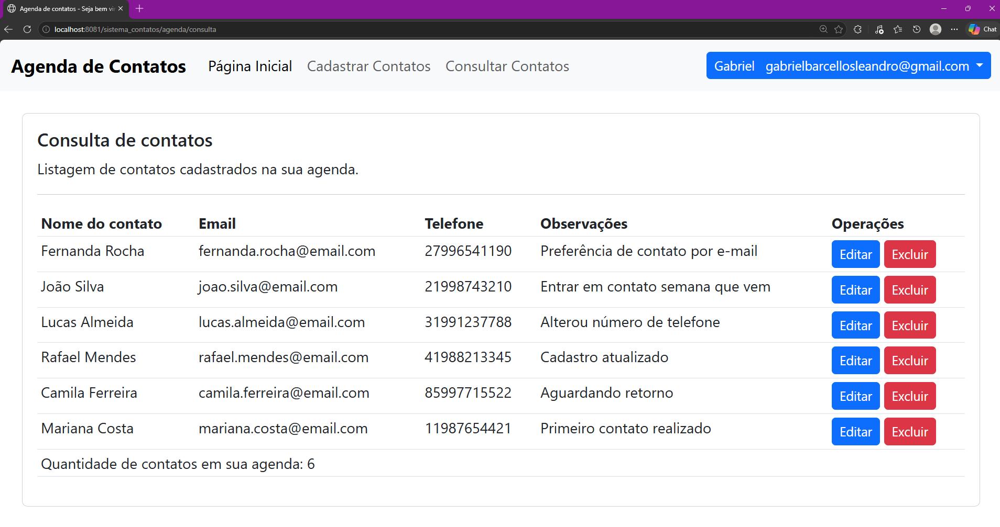

# Sistema de Contatos

Aplicação web de gerenciamento de contatos desenvolvida com Java e Spring MVC.

O sistema permite o cadastro de usuários, autenticação e gerenciamento completo de contatos.

---

## Página inicial


---

## Funcionalidades

- Cadastro de usuários
- Login com autenticação
- Recuperação de senha por e-mail
- Alteração de senha para usuários autenticados
- CRUD de contatos
- Proteção de rotas (acesso apenas autenticado)
- Logout

---

## Login de usuário


---

## Consulta de contatos


---

## Minha conta de usuário


---

## Recuperação de senha por email


---

## Tecnologias utilizadas

- Java
- Spring MVC
- JSP
- JDBC
- PostgreSQL
- Bootstrap
- Maven
- Tomcat
- JavaMail
- Lombok

---

## Recuperação de senha

A funcionalidade de envio de e-mail foi implementada utilizando o Mailtrap (ambiente sandbox) para testes.

Em ambiente de produção, o SMTP pode ser configurado para serviços como Gmail ou Outlook.

---

## Como executar o projeto

```bash
git clone https://github.com/Gbarcelloss/sistema_contatos.git
```
